  

  

  
  
  

## Table of Contents

- [About Me](#about-me)
- [Technical Arsenal](#technical-arsenal)
- [Coding Statistics](#my-coding-statistics-real-data)
- [Tech Stack Visualization](#comprehensive-tech-stack-visualization)
- [Featured Projects & Innovations](#featured-projects--innovations)
- [GitHub Analytics](#github-analytics)
- [Contribution Metrics](#contribution-metrics)
- [WakaTime Coding Stats](#wakatime-coding-stats)

 
 

  

 

  

## 🚀 About Me

I'm a passionate **Computer Science student** at Baze University with a deep love for creating innovative solutions through code. My journey spans across multiple programming languages and frameworks, with a particular focus on **web development**, **mobile apps**, and **open-source contributions**.

```mermaid
graph TD
    A[🎯 My Focus Areas] --> B[💻 Web Development]
    A --> C[📱 Mobile Development]
    A --> D[🌐 Open Source]
    A --> E[🤖 AI & ML]
    
    B --> B1[React/Next.js]
    B --> B2[Full Stack Apps]
    
    C --> C1[Flutter]
    C --> C2[React Native]
    
    D --> D1[Contributing]
    D --> D2[Building Tools]
    
    E --> E1[Python AI]
    E --> E2[Data Science]
```

💡 **What drives me:**
- 🏗️ Building scalable web applications with modern technologies
- 🤝 Contributing to open-source projects that make a difference
- 🔬 Exploring the intersection of AI and software development
- 🛠️ Creating tools that solve real-world problems
- 📚 Continuous learning and knowledge sharing

🎯 **Currently working on:** Building full-stack applications and expanding my knowledge in cloud technologies

  

## 🛠️ Technical Arsenal

```mermaid
mindmap
  root((🧠 Tech Arsenal))
    Frontend
      TypeScript (59.67%)
      React.js
      Next.js  
      Vue.js
      JavaScript (7.96%)
    Backend
      FastAPI
      Node.js
      Python (6.08%)
      Prisma ORM
    Mobile
      Dart (9.84%)
      Flutter
      React Native
    Databases
      MongoDB
      PostgreSQL
      SQLite
      Firebase
    Languages
      Java
      C/C++
      C#
    Tools & Editors
      VS Code (90.75%)
      Android Studio (6.91%)
      Visual Studio (2.23%)
      IntelliJ IDEA
      Blender
```

### 🎨 Comprehensive Tech Stack Visualization

#### Frontend Technologies

  

#### Backend & APIs

  

#### Mobile Development

  

#### Programming Languages

  

#### Databases & Storage

  

#### DevOps & Cloud

  

#### Development Tools

  

#### Design & 3D

  

### 📈 Development Workflow

```mermaid
flowchart LR
    A[💡 Idea] --> B[📋 Planning]
    B --> C[🎨 Design]
    C --> D[⚡ Development]
    D --> E[🧪 Testing]
    E --> F[🚀 Deployment]
    F --> G[📊 Monitoring]
    G --> H[🔄 Iteration]
    H --> D
```

## 📊 GitHub Analytics

  

  
  

  

## 🏆 GitHub Achievements & Trophies

  

## 📈 Contribution Metrics

  

  

## ⚡ Coding Activity & Statistics

  
  

  
  

## 💻 WakaTime Coding Stats

  

## 🤝 Let's Connect & Collaborate!

  
  
  
  
  
  

### 🌟 Open for:
- 💼 **Freelance Projects** - Web & Mobile Development
- 🤝 **Collaborations** - Open Source Contributions
- 🎓 **Mentorship** - Learning & Knowledge Sharing
- 💡 **Innovation** - Startup Ideas & Tech Solutions

### 🔥 Developer Superpowers
- ⚡ **Lightning Fast Prototyping** - Idea to MVP in 48 hours
- 🧠 **Pattern Recognition Master** - Spot optimization opportunities instantly  
- 🔍 **Debug Detective** - Can find bugs others miss
- 🏗️ **Architecture Architect** - Design scalable systems from scratch
- 🤖 **AI Integration Wizard** - Make any app smarter with AI
- 📱 **Cross-Platform Champion** - One codebase, multiple platforms
- 🎯 **Performance Perfectionist** - Sub-second load times obsession

### 💡 Innovation Philosophy
> *"Code is poetry written in logic. Every function should tell a story, every component should have a purpose, and every project should solve a real problem."*

```mermaid
mindmap
  root((💡 My Innovation Principles))
    User First
      Intuitive Design
      Accessible Interfaces
      Real Problem Solving
    Clean Code
      Readable Functions
      Maintainable Architecture
      Comprehensive Testing
    Continuous Growth
      Learn Daily
      Experiment Boldly
      Share Knowledge
    Global Impact
      Open Source
      Community Building
      Mentorship
```

## 🎨 Design Philosophy

```mermaid
mindmap
  root((💡 My Code Philosophy))
    Clean Code
      Readable
      Maintainable
      Scalable
    User Experience
      Intuitive
      Accessible
      Beautiful
    Performance
      Fast
      Efficient
      Optimized
    Community
      Open Source
      Collaboration
      Knowledge Sharing
```

---

  

  <h2>🚀 "Code is like humor. When you have to explain it, it's bad." - Cory House</h2>

  

  

  <i>⭐️ From <a href="https://github.com/syipmong">syipmong</a> - Let's build something amazing together!</i>
    
  
  

  
  
  

