  

  

  
  
  

 

  

 

  

## 🚀 About Me

I'm a passionate **Computer Science student** at Baze University with a deep love for creating innovative solutions through code. My journey spans across multiple programming languages and frameworks, with a particular focus on **web development**, **mobile apps**, and **open-source contributions**.

```mermaid
graph TD
    A[🎯 My Focus Areas] --> B[💻 Web Development]
    A --> C[📱 Mobile Development]
    A --> D[🌐 Open Source]
    A --> E[🤖 AI & ML]
    
    B --> B1[React/Next.js]
    B --> B2[Full Stack Apps]
    
    C --> C1[Flutter]
    C --> C2[React Native]
    
    D --> D1[Contributing]
    D --> D2[Building Tools]
    
    E --> E1[Python AI]
    E --> E2[Data Science]
```

💡 **What drives me:**
- 🏗️ Building scalable web applications with modern technologies
- 🤝 Contributing to open-source projects that make a difference
- 🔬 Exploring the intersection of AI and software development
- 🛠️ Creating tools that solve real-world problems
- 📚 Continuous learning and knowledge sharing

🎯 **Currently working on:** Building full-stack applications and expanding my knowledge in cloud technologies

  

## 🛠️ Technical Arsenal

```mermaid
mindmap
  root((🧠 Skills))
    Frontend
      React
      Next.js
      Flutter
      TypeScript
    Backend
      Node.js
      Python
      Django
      Flask
    Database
      MySQL
      SQLite
      Firebase
    Tools
      Git
      Docker
      Linux
      Figma
```

### Programming Languages

  

### Frameworks & Libraries

  

### Tools & Technologies

  

### 📈 Development Workflow

```mermaid
flowchart LR
    A[💡 Idea] --> B[📋 Planning]
    B --> C[🎨 Design]
    C --> D[⚡ Development]
    D --> E[🧪 Testing]
    E --> F[🚀 Deployment]
    F --> G[📊 Monitoring]
    G --> H[🔄 Iteration]
    H --> D
```

### 🎯 Learning Path & Goals

## 🌟 Featured Projects

### 🔥 [Yeep Programming Language](https://github.com/syipmong/yeep)
An interpreted programming language with support for functions and object-oriented programming
- **Tech Stack:** Python, Lexical Analysis, Parser Design
- **Features:** Custom syntax, OOP support, Built-in functions

```mermaid
graph LR
    A[📝 Source Code] --> B[🔍 Lexer]
    B --> C[🌳 Parser]
    C --> D[🎯 AST]
    D --> E[⚡ Interpreter]
    E --> F[📤 Output]
```

### 💰 [Expense Tracker](https://github.com/syipmong/expense-tracker)
A comprehensive expense management tool for personal finance tracking
- **Tech Stack:** React, Node.js, MongoDB
- **Features:** Real-time tracking, Budget planning, Data visualization

```mermaid
flowchart TD
    A[👤 User] --> B[📱 Frontend]
    B --> C[🔗 API]
    C --> D[💾 Database]
    D --> E[📊 Analytics]
    E --> F[📈 Reports]
```

### 🏫 [Open School Platform](https://github.com/syipmong/open-school)
Open-source educational platform combining video conferencing and classroom management
- **Tech Stack:** Next.js, WebRTC, Socket.io
- **Features:** Virtual classrooms, Assignment management, Real-time collaboration

### 🏢 [NXDI Website](https://nxditechnologysolutions.com.ng)
Corporate website for a Nigerian software development company
- **Tech Stack:** Next.js, TypeScript, Tailwind CSS
- **Features:** Modern design, Performance optimization, SEO friendly

## 📊 GitHub Analytics

  

  
  

  

## 🏆 GitHub Achievements & Trophies

  

## 📈 Contribution Metrics

  

  

## ⚡ Coding Activity & Statistics

  
  

  
  

## 💻 WakaTime Coding Stats

  

## 🌐 Detailed Tech Stack

<h3 align="left">Languages and Tools:</h3>

  
  
  
  
  
  
  
  
  
  
  
  
  
  
  
  
  
  
  
  
  
  
  
  

## 🤝 Let's Connect & Collaborate!

  
  
  
  
  
  

### 🌟 Open for:
- 💼 **Freelance Projects** - Web & Mobile Development
- 🤝 **Collaborations** - Open Source Contributions
- 🎓 **Mentorship** - Learning & Knowledge Sharing
- 💡 **Innovation** - Startup Ideas & Tech Solutions

### 📚 Education & Certifications

**Formal Education:**
- 🎓 **Bachelor's in Computer Science** - Baze University (2022-2026)

**Online Certifications & Courses:**
- 📜 **Sololearn** - JavaScript, Python, C++, Java
- 🏆 **freeCodeCamp** - Responsive Web Design, JavaScript
- 📖 **W3Schools** - Full Stack Web Development

## 🎯 Current Focus & Future Goals

### 🔥 What I'm Working On:
- 🚀 Building a **SaaS expense management platform**
- 🤖 Learning **AI/ML with Python and TensorFlow**
- ☁️ Exploring **cloud technologies** (AWS, Google Cloud)
- 📱 Developing cross-platform mobile apps with **Flutter**

### 🎪 Fun Facts About Me:
- 🌍 I'm from **Nigeria** 🇳🇬
- 💻 I wrote my first "Hello World" in **2022**
- 🎮 I enjoy gaming when not coding
- 📚 I love teaching and sharing knowledge
- 🌟 I believe in **"Code with Purpose"**

## 🎨 Design Philosophy

```mermaid
mindmap
  root((💡 My Code Philosophy))
    Clean Code
      Readable
      Maintainable
      Scalable
    User Experience
      Intuitive
      Accessible
      Beautiful
    Performance
      Fast
      Efficient
      Optimized
    Community
      Open Source
      Collaboration
      Knowledge Sharing
```

---

  

  <h2>🚀 "Code is like humor. When you have to explain it, it's bad." - Cory House</h2>

  

  

  <i>⭐️ From <a href="https://github.com/syipmong">syipmong</a> - Let's build something amazing together!</i>
    
  
  

  
  
  

